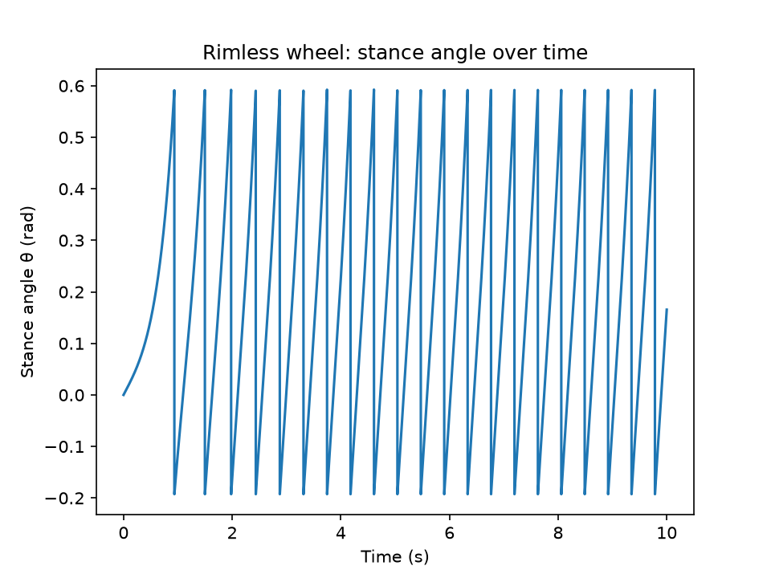
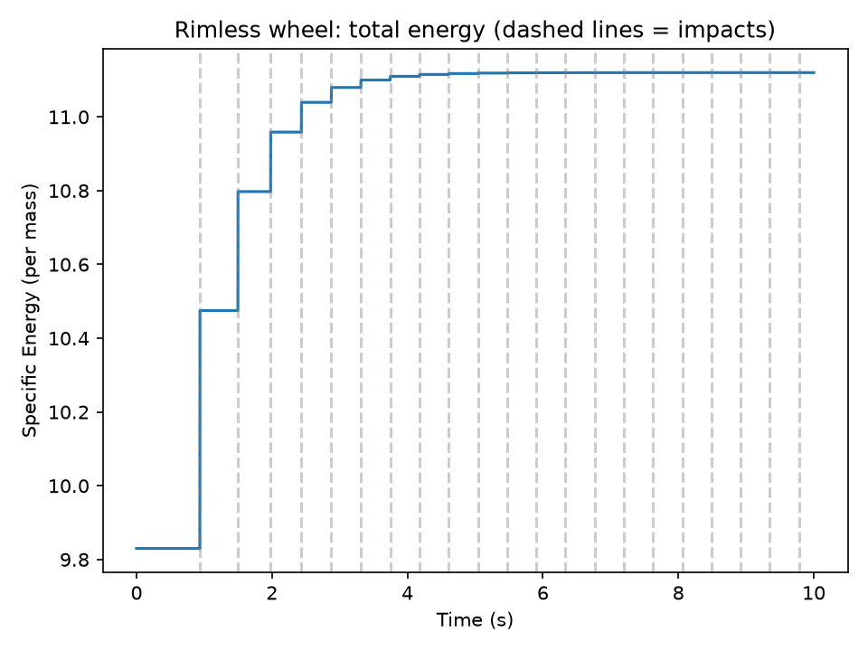
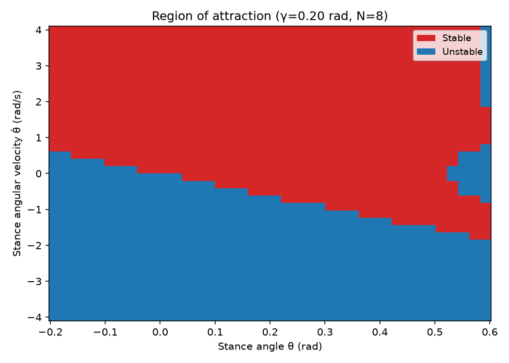
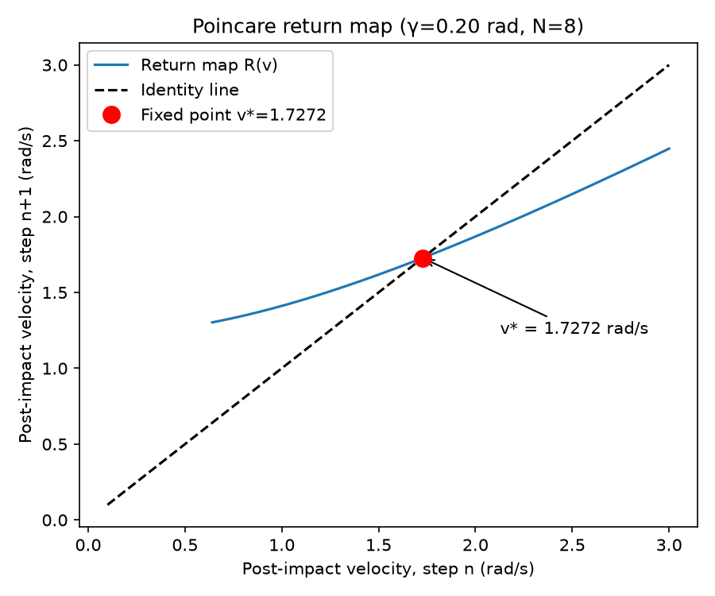
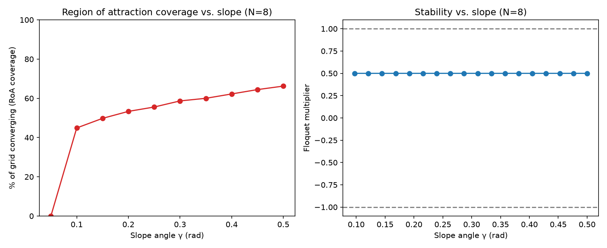
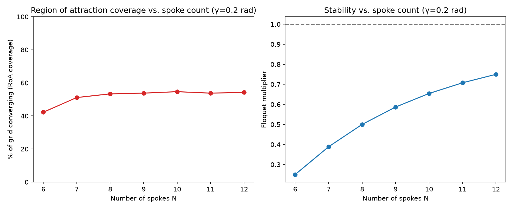
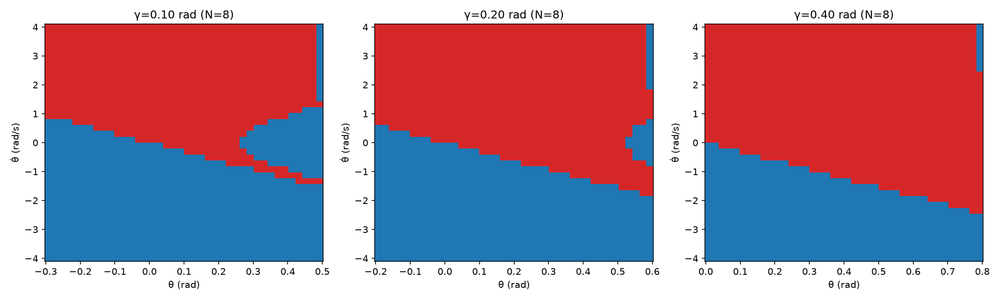
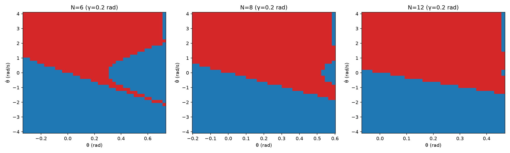

# Sanity Check Report

## Stance Angle Over Time

I graphed the angle of the stance leg over time, to ensure that it looks fine, and that it was resetting to 2γ − θ, with the velocity being set to theta_dot·cos(2alpha). On this graph, you can also see that the time it takes between the resets of the stance either increases or decreases based on the initial conditions.

Theta over time plot (Sanity Check):

## Specific Energy Over Time

I also graphed the specific energy of the system, as this shows the stability of the system better. I graphed it from 0-10s, as that was typically how much time it would take for the system to stabilize to a stable energy, or show that it was unstable.

When starting from a small initial push, it would gain energy over the course of a cycle, and it would lose energy over the course of a cycle if given a large initial velocity — in both cases, that net change is the result of gravitational energy added during the continuous swing phase, while **the impact itself always dissipates kinetic energy** (never supplies it) at every reset, regardless of the starting condition.

We expected all of the stable results to converge to the same constant energy (and a limit cycle), which it did.

Total Energy plot (Sanity Check):

## Unstable (Non-Rolling) Runs

On the unstable runs where it does not successfully continue rotating, we expect it to oscillate and bounce back and forth within the same 2 spokes, which it appears to do. Instead of a resetting graph, it is a sin wave.

## Analysis: Convergence to the Limit Cycle

In the analysis file, we expect that starting from a point will eventually lead to the limit cycle. This agrees with our graph, which shows that when it has more energy, the change in theta_dot is smaller, and it loses speed to the v*. If it has less energy, it gains more during the impact and speeds up.

RoA Map

## Return Map

## Effect of Slope Angle (γ)

When increasing gamma, an increasing number of initial conditions allow the wheel to reach the steady state velocity. This makes sense as it is easier to convert gravitational potential energy into kinetic energy to continue rolling. Gamma does not have an effect on the floquet multiplier. This indicates that there is no effect on the local convergence of the system.

## Effect of Number of Spokes (N)

Increasing the number of spokes makes the system closer to a fully circular wheel rolling down a ramp. As such, increasing the spokes slowly increases how many cases in the RoA converge. This is also shown in the increasing floquet numbers. An increase in spokes increases the Floquet number, indicating slower local convergence and weaker disturbance rejection, meaning the system takes significantly more strides to damp out any perturbations and reach the steady state.

## Region of Attraction vs. γ and N

We can plot the actual ROA vs gamma and N graphs also to see exactly how changing the gamma and the spoke number affect the ROA plot.

