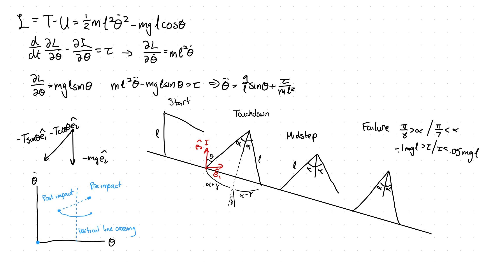

# Assignment 2: Inverted Pendulum Walker — Report

## Sketch

## Region of Attraction

The ankle controller combines feedback linearization (to cancel the
gravity term, g/l * sin(theta)) with a PD stabilizing term:

torque = m * l^2 * (-kp*theta - kd*theta_dot - (g/l)*sin(theta)), clipped to [-0.1*m*g*l, 0.05*m*g*l]

with gains kp = 9, kd = 6 (chosen by trial and error for a smooth but not
overly damped response). The region of attraction was found by a grid
search over theta and theta_dot in [-0.5, 0.5] (kept small and focused, per
the assignment's guidance), simulating each starting point for 5 seconds
and checking convergence to the origin:

The RoA forms a diagonal band containing 143 of the 400 grid points tested.
It is not a symmetric disc around the origin: states where theta and
theta_dot have opposite signs (i.e. already moving back toward vertical)
are captured over a wider range than states where both push in the same
direction, which is consistent with the PD law's "least correction needed"
line, roughly theta = -(kd/kp) * theta_dot.

## Choice of Poincaré Section

In the rimless wheel, touchdown was a convenient section because the
touchdown angle (theta_TD = gamma + alpha) was a fixed constant (set by the
spoke spacing). Here, alpha is a per-step control input rather than a
geometric constant, so theta_TD moves every time a different alpha is
chosen — touchdown is no longer a fixed value of theta, and using it as a
section would violate the requirement that theta be constant on the
section.

Instead, **theta = 0 (mid-stance, the upright crossing)** is used as the
section:

- **theta is constant on the section** — trivially, since it is defined by
  theta = 0 regardless of what alpha was chosen for that step.
- **Transverse to the flow** — during normal forward walking, the leg
  swings through vertical with theta_dot not equal to 0 (it is mid-swing,
  not at a turning point), so trajectories cross the section rather than
  run tangent to it.
- **Leaves exactly one free state, theta_dot_k** — at the crossing, theta =
  0 is fixed, so the only remaining coordinate is theta_dot, which is
  exactly the single state the step-to-step return map needs.

The phase portrait below confirms this empirically: every pass through
theta = 0 during the sample trajectory has clearly nonzero slope (visible
"corners" rather than tangencies), and the section correctly reduces the
full continuous trajectory to a simple 1-D sequence of theta_dot_k values:

## Grid Resolution Verification

**Criterion used:** build the state-action lookup table at increasing
resolutions (M, K), and at each resolution, actually simulate (full
continuous dynamics, not just table lookups) how many real footsteps four
test initial velocities (theta_dot_0 = 0.5, 1.5, 2.5, 3.5 rad/s) take to
reach the RoA, following that table's own policy. These are compared
against a much finer 35x21 reference table. A resolution is considered
"fine enough" if every test point's simulated step count agrees with the
reference within 1 step (some jitter is expected from nearest-grid-point
policy lookup even as resolution improves, so exact agreement at every
resolution is not a meaningful bar).

| M | K | theta_dot_0=0.5 | 1.5 | 2.5 | 3.5 | Result |
|---|---|---|---|---|---|---|
| 35 (reference) | 21 | 1 | 2 | 4 | 5 | — |
| 6 | 4 | unreachable | unreachable | unreachable | unreachable | **FAILS** |
| 9 | 6 | 1 | unreachable | unreachable | 4 | **FAILS** |
| **12** | **7** | 1 | 3 | 4 | 5 | **PASSES** |
| 15 | 9 | 1 | 3 | 3 | 4 | passes |
| 20 | 12 | 1 | 3 | 4 | 4 | passes |
| 25 | 15 | 1 | 2 | 4 | 4 | passes |

**M = 12, K = 7 is the coarsest resolution that passes.** The
next-coarser candidate, M = 9, K = 7, fails outright: two of the four test
velocities (theta_dot_0 = 1.5 and 2.5) become entirely unreachable within
the step cap at that resolution, even though the finer reference finds
valid solutions (2 and 4 steps respectively) for both. M = 6 fails even
more severely, with every test point unreachable. This confirms M = 12 is
both necessary (M = 9 is measurably worse) and sufficient (M = 15 and above
give no further qualitative improvement, just minor jitter of ±1 step).

## At Least 3-Step Trajectory and Maximum Sustainable Steps

Using the chosen M = 12, K = 7 table, theta_dot_0 = 4.429 rad/s (the
Froude-2 bound itself) is used as the example initial condition. This
point was chosen deliberately: it is one of several grid states where the
optimal (fewest-footsteps) and maximally-delaying policies select a
**different** alpha on the very first footstep, so the two trajectories
visibly diverge from the start rather than tracking identically for a few
steps before splitting apart.

The table predicts the optimal policy needs 4 steps at this resolution;
simulating the real continuous trajectory under that policy actually takes
**6 real footsteps** to reach the RoA (the discrepancy between the table's
prediction and the real simulation is the expected discretization error at
this resolution, consistent with the ±1-step tolerance established above —
here it compounds slightly further since several steps are chained
together before reaching the RoA).

For this same initial condition, the maximum number of steps the walker
could be made to sustain before being forced into the RoA — using a
deliberately delaying (but still valid) choice of alpha at each step,
rather than the fastest route in — is **7 steps**.

The left panel shows theta over time for both policies, with footstrikes
marked: the thick, semi-transparent orange trace is the maximally-delaying
policy, and the dashed blue trace on top of it is the optimal policy. The
two diverge immediately (different footstrike timing from the very first
step), and the optimal trajectory reaches the RoA and stops one footstrike
earlier than the delaying one. The right panel summarizes the two step
counts (6 vs. 7) side by side.

## Steps to Standstill by Initial Condition

For every state on the chosen M = 12 grid, the minimum number of footsteps
to reach standstill (using the best available alpha at each step) was
computed by backward chaining from the states that reach the RoA directly:

| theta_dot_k (rad/s) | Best alpha (rad) | Steps to standstill |
|---|---|---|
| 0.000 | — | unreachable |
| 0.403 | 0.393 | 1 |
| 0.805 | 0.421 | 1 |
| 1.208 | 0.393 | 2 |
| 1.611 | 0.411 | 2 |
| 2.013 | 0.393 | 3 |
| 2.416 | 0.393 | 3 |
| 2.819 | 0.421 | 3 |
| 3.221 | 0.393 | 4 |
| 3.624 | 0.393 | 4 |
| 4.027 | 0.393 | 4 |
| 4.429 | 0.411 | 4 |

Only theta_dot_k = 0 is unreachable, which is expected: it is an exact
fixed point of the passive swing dynamics (theta_ddot = g/l * sin(0) = 0),
so a footstep never actually gets taken from rest without some external
push. Step count grows monotonically with initial velocity, from 1 step
near theta_dot_k of about 0.4-0.8 up to 4 steps by the Froude-2 bound
(theta_dot_k of about 4.43) — consistent with the intuition that more
initial energy requires more footsteps to shed before the ankle controller
can take over.

The left panel is the state-action lookup table itself: the dark region
shows which (theta_dot_k, alpha) pairs land directly in the RoA in a single
footstep. The right panel is the resulting steps-to-standstill curve
described above.