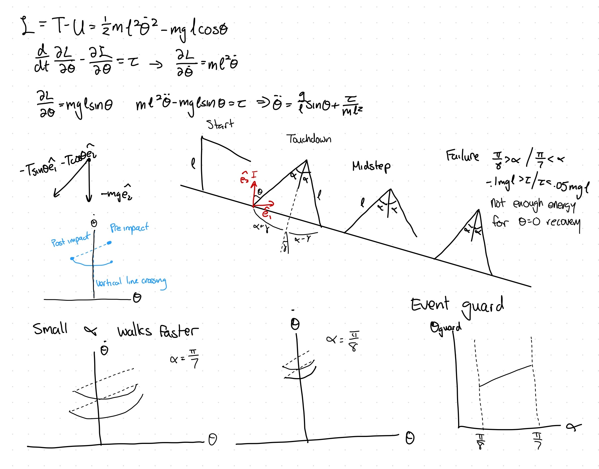

# Assignment 2: Inverted Pendulum Walker — Report

## Sketch

## Region of Attraction

The ankle controller combines feedback linearization to cancel the gravity term, g/l * sin(theta) with a PD stabilizing term:

torque = m * l^2 * (-kp*theta - kd*theta_dot - (g/l)*sin(theta)), clipped to [-0.1*m*g*l, 0.05*m*g*l]

with gains kp = 9, kd = 6. These were chosen somewhat arbitrarily, but were found to be a good balance between smoothness while not being overly damped. The region of attraction was found by a grid search over theta and theta_dot in [-0.5, 0.5], simulating each starting point for 5 seconds and checking convergence to the origin:

The RoA forms a diagonal band pattern down the origin. It is consistent with the PD law's "least correction needed" line, roughly theta = -(kd/kp) * theta_dot.

## Choice of Poincaré Section

In the rimless wheel, I initially used touchdown as a convenient section because the touchdown angle (theta_TD = gamma + alpha) is a fixed constant set by the spoke spacing. However, since alpha is a per-step control input rather than a geometric constant, theta_TD moves every time a different alpha is chosen. This means the touchdown is no longer a fixed value of theta and using it as a section would violate the requirement that theta be constant on the section.

Instead, theta = 0 is used as the section. During normal forward walking, the leg swings through the vertical with theta_dot not equal to 0 (it is mid-swing), so trajectories cross the section rather than run tangent to it. At the crossing, theta = 0 is fixed, so the only remaining coordinate is theta_dot. The phase portrait below confirms this, showing that every pass through theta = 0 has nonzero slope, and the section correctly reduces the full continuous trajectory to a simple 1-D sequence of theta_dot_k values:

## Grid Resolution Verification

I tested the lookup table at different grid sizes to figure out how fine the grid actually needs to be. M is how many points I used for the state axis (starting velocity), and K is how many points I used for the action axis (angle of attack). I kept M and K equal (M = K) rather than scaling them differently, since there was no principled reason to treat the two axes differently.

For each grid size, I simulated the walker's real continuous trajectory (not just the table's predicted step count) starting from 15 different probe velocities, evenly spread from 0.3 to about 4.2 rad/s, and counted how many real footsteps each one took to reach standstill. I compared those counts against a much finer 35x35 grid, treated as the "true" answer. A grid size was called "good enough" only if every one of the 15 probe velocities landed within 1 step of that true answer (some jitter is normal even at fine resolutions, since the policy always rounds to the nearest grid point, so exact agreement wasn't required).

I originally tried this with just 4 probe velocities, but found the result was sensitive to which 4 I happened to pick — a small, coarse grid could get lucky and match well on one set of test points while failing badly on another, purely because nearest-grid-point lookup makes the policy a step function. Testing against 15 points instead of 4 makes the pass/fail call much more reliable, since a coarse grid can't get lucky against that many probes at once.

| M | K | Probe points matching (of 15) | Worst-case deviation | Result |
|---|---|---|---|---|
| 35 (reference) | 35 | — | — | — |
| 3 | 3 | 0 | — (nothing reachable) | FAILS |
| 4 | 4 | 13 | 1+ (some unreachable) | FAILS |
| 6 | 6 | 14 | 1+ (some unreachable) | FAILS |
| **9** | **9** | 15 | 1 | **PASSES** |
| 12 | 12 | 15 | 1 | passes |
| 15 | 15 | 15 | 1 | passes |
| 20 | 20 | 15 | 1 | passes |
| 25 | 25 | 15 | 1 | passes |

M = 9, K = 9 is the smallest grid size that gets every single probe point within 1 step of the reference. At M = 6, one probe velocity (0.3 rad/s) never even reaches standstill, even though the fine reference grid solves it fine. At M = 4, two probe velocities fail the same way. At M = 3, nothing reaches standstill at all. M = 9 was the first size that passed every probe. Anything finer than that (M = 12 and up) doesn't really improve things further — it's already matching all 15 probes.

## At Least 3-Step Trajectory and Maximum Sustainable Steps

I used theta_dot_0 = 3.5 rad/s as my example, chosen so that the optimal policy takes 4 real footsteps. The table predicts the fastest policy would take 3 steps at this resolution. When I actually ran the real simulation with that policy, it took 4 steps to reach standstill. That gap between the table's prediction and the real simulation is expected — the table only checks a limited number of grid points, so its predictions and the real simulation won't always match exactly. For that same starting speed, I also checked how long the walker could be kept walking if it deliberately avoided settling down early. Using that "stall for time" policy, it took 5 steps instead of 4.

The left panel shows theta over time for both policies, with footstrikes marked: the thick, semi-transparent orange trace is the maximally-delaying policy, and the dashed blue trace on top of it is the optimal policy. The two trajectories track together for the first two footsteps, then diverge on the third, where the delaying policy chooses a different angle of attack that avoids landing in the RoA immediately. The right panel summarizes the two step counts (4 vs. 5) side by side.

## Steps to Standstill by Initial Condition

For every state on the chosen M = 9 grid, the minimum number of footsteps to reach standstill (using the best available alpha at each step) was computed by backward chaining from the states that reach the RoA directly:

| theta_dot_k (rad/s) | Best alpha (rad) | Steps to standstill |
|---|---|---|
| 0.000 | — | unreachable |
| 0.554 | 0.393 | 1 |
| 1.107 | 0.393 | 1 |
| 1.661 | 0.449 | 1 |
| 2.215 | 0.393 | 2 |
| 2.768 | 0.393 | 2 |
| 3.322 | 0.393 | 3 |
| 3.876 | 0.393 | 3 |
| 4.429 | 0.407 | 3 |

